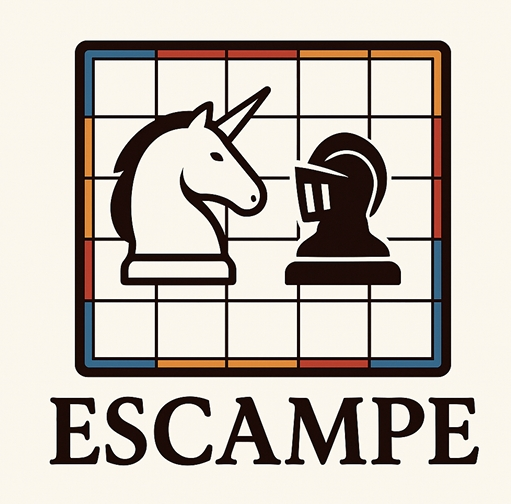

# Escampe - Jeu de stratégie avec IA

## 📝 Description

Escampe est un jeu de stratégie à deux joueurs qui se joue sur un plateau de 36 cases (6×6). Chaque joueur dispose de 6 pièces : une licorne et 5 paladins. Le but du jeu est de capturer la licorne adverse avec l'un de ses paladins.

Cette implémentation en Java propose :
- Un mode joueur contre joueur
- Un mode joueur contre IA (basée sur l'algorithme MinMax)
- Un mode IA contre IA pour démonstration
- Une interface en ligne de commande



## 🎮 Règles du jeu

### Plateau et pièces
- Le plateau est composé de 36 cases (6×6)
- Chaque case est marquée par un liseré simple (1), double (2) ou triple (3)
- Chaque joueur possède 6 pièces : 1 licorne et 5 paladins

### Déroulement du jeu
1. Le joueur Noir choisit un bord du plateau (haut ou bas) et place ses pièces sur les deux premières lignes de ce bord
2. Le joueur Blanc place ses pièces sur les deux premières lignes du bord opposé et joue en premier
3. À chaque tour, le joueur doit déplacer une pièce qui se trouve sur une case ayant le même liseré que celle où l'adversaire a posé sa pièce au tour précédent
4. Le liseré détermine la distance de déplacement : 1 case pour un liseré simple, 2 cases pour un liseré double, 3 cases pour un liseré triple
5. Les déplacements se font en ligne droite (pas en diagonale) et sans sauter par-dessus d'autres pièces
6. Si un joueur ne peut pas jouer, il passe son tour
7. La partie se termine quand un joueur capture la licorne adverse avec l'un de ses paladins

## 🚀 Installation

### Prérequis
- Java JDK 8 ou supérieur

### Compilation
```bash
javac Partie1.java EscampeBoard.java
